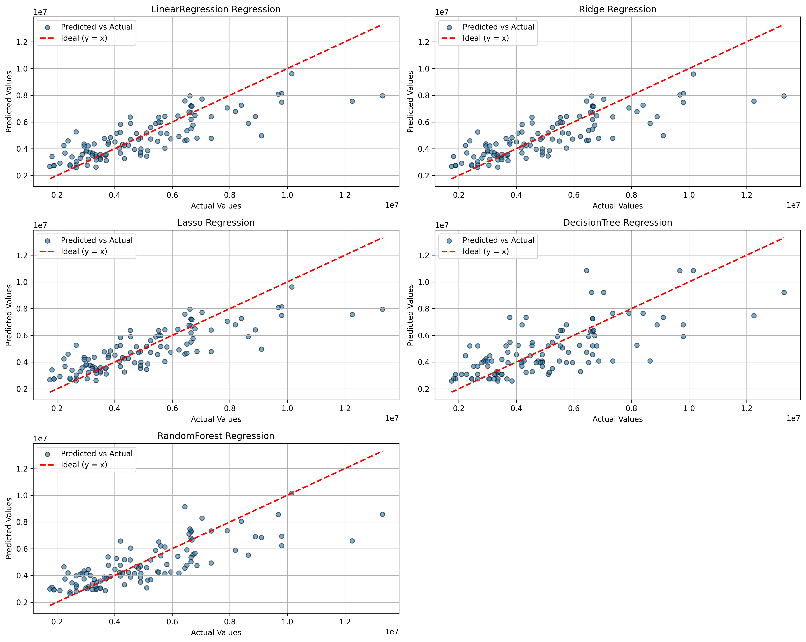
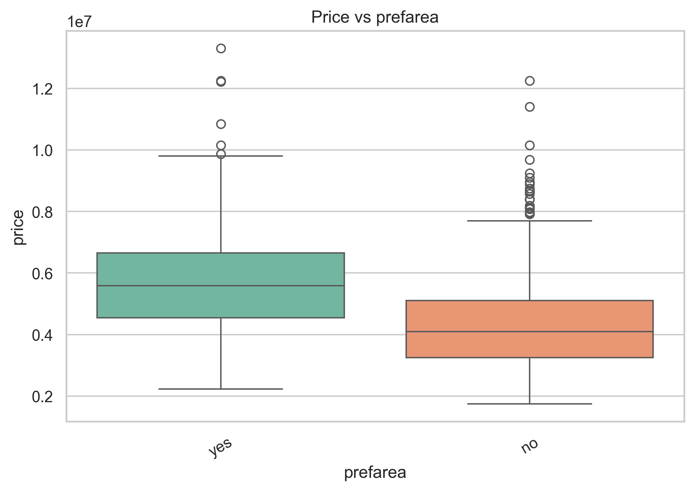
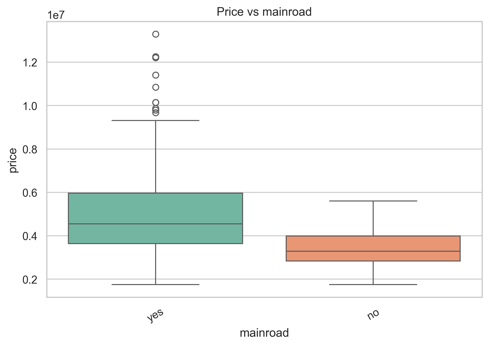
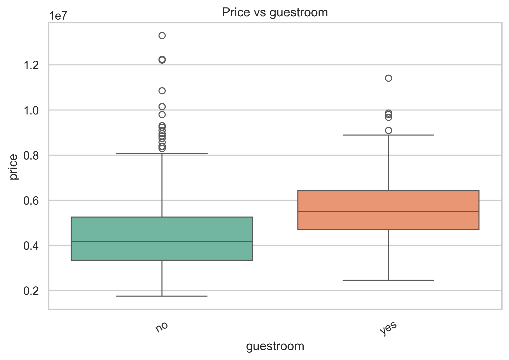
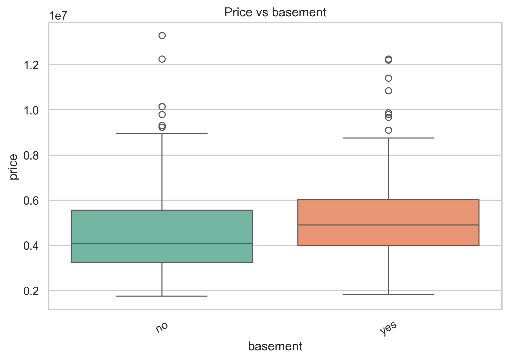
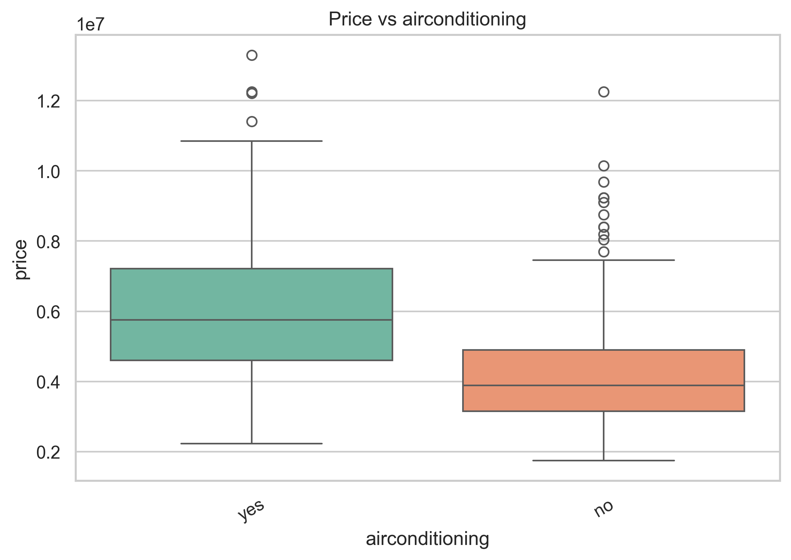
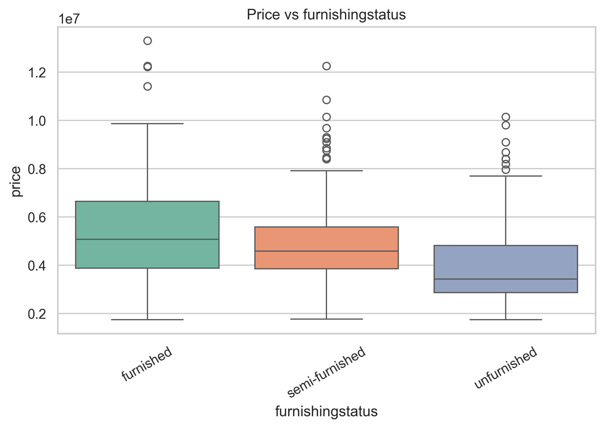
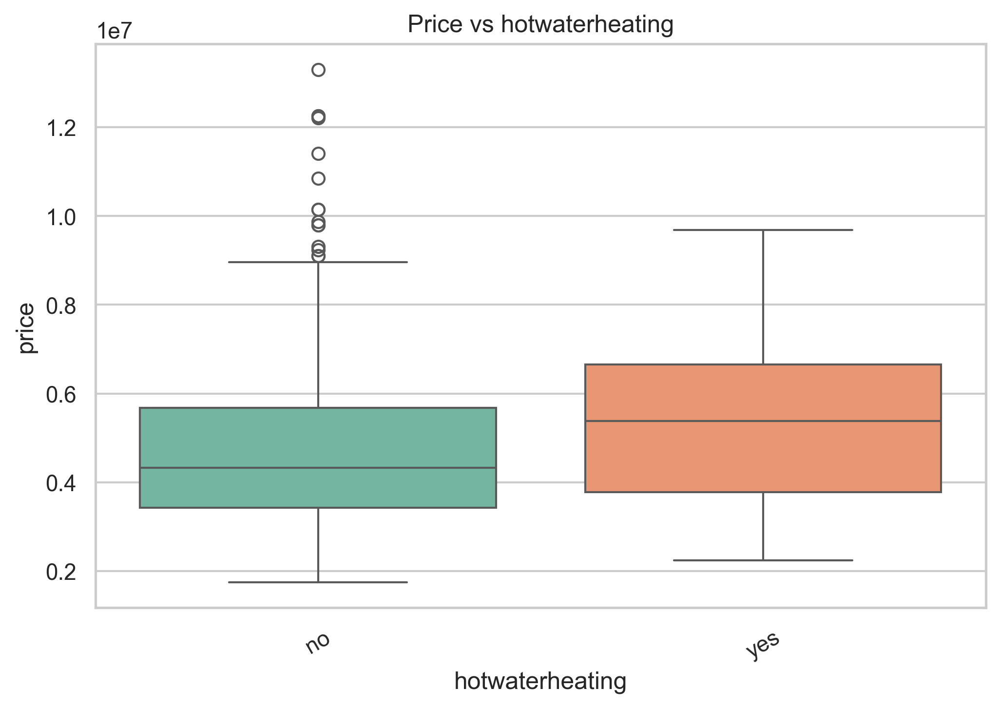

# Housing Price Regression Report

## Abstract
هدف این مطالعه، مدل‌سازی و پیش‌بینی قیمت ملک بر اساس ویژگی‌های فیزیکی و مکانی بوده است. داده‌ها از مجموعه Housing.csv استخراج و پیش‌پردازش شدند تا نویز ناشی از داده‌های گمشده و دسته‌ای کاهش یابد. سپس چند الگوریتم رگرسیونی کلاسیک و درختی با معیارهای خطای MAE، RMSE و \(R^2\) ارزیابی شدند. نتایج نشان می‌دهد مدل‌های خطی در این دیتاست پایداری و تعمیم‌پذیری بهتری ارائه می‌کنند، در حالی‌که مدل‌های درختی بدون تنظیمات دقیق‌تر دچار پراکندگی و خطای بالاتر می‌شوند. همچنین تحلیل اکتشافی نشان داد که عوامل مکانی و امکانات رفاهی نقش معنی‌داری در سطح قیمت دارند.

---

## Method

### Dataset
- **Source:** Housing.csv  
- **Target Variable:** `price`  
- **Feature Types:**  
  - عددی: `area`, `bedrooms`, `bathrooms`, `stories`, …  
  - دسته‌ای: `mainroad`, `guestroom`, `hotwaterheating`, `prefarea`, `furnishingstatus`, …  

### Preprocessing
- **Missing Values (Numerical):** Median Imputation  
- **Missing Values (Categorical):** Most-Frequent Imputation  
- **Categorical Encoding:** One-Hot Encoding  
- **Train/Test Split:** 80/20  

### Models
- Linear Regression  
- Ridge Regression  
- Lasso Regression  
- Decision Tree Regression  
- Random Forest Regression  

### Evaluation Metrics
- MAE (Mean Absolute Error)  
- RMSE (Root Mean Squared Error)  
- \(R^2\) (Coefficient of Determination)  
- 5-Fold Cross-Validation  

---

## Results & Discussion

### 1) Predicted vs Actual (Model Diagnostics)
نمودارهای Predicted vs Actual نشان می‌دهند مدل‌های خطی (Linear, Ridge, Lasso) به‌طور معناداری نزدیک‌ترین هم‌راستایی را با خط ایده‌آل \(y=x\) دارند. این الگو نشان‌دهنده‌ی خطای سیستماتیک پایین و تعمیم‌پذیری مناسب است. در مقابل، **Decision Tree** دارای پراکندگی گسترده‌تری است که نشانه‌ی ناپایداری و overfitting است. **Random Forest** اگرچه بهبود نسبت به درخت تکی نشان می‌دهد، اما در قیمت‌های اکستریم هنوز انحراف محسوس وجود دارد.

---

### 2) Categorical Features – Boxplot Analysis
تحلیل Boxplot متغیرهای دسته‌ای نشان می‌دهد که عوامل مکانی و امکانات رفاهی نقش کلیدی در افزایش قیمت دارند:

- **prefarea:** قوی‌ترین جدایش توزیعی را ایجاد کرده است؛ واحدهایی در مناطق ترجیحی به‌طور سیستماتیک قیمت بالاتری دارند.  
- **mainroad:** دسترسی به خیابان اصلی اثر مثبت و پایدار بر قیمت دارد.  
- **guestroom, basement, airconditioning:** هرکدام با افزایش میانه قیمت همراه هستند و اثر رفاهی قابل‌مشاهده دارند.  
- **furnishingstatus:** تفاوت قیمت بین واحدهای furnished و unfurnished نیز به‌طور واضح در توزیع قیمت دیده می‌شود.

#### Boxplots:

---

### 3) Distributional Insight
توزیع قیمت‌ها چولگی مثبت (right-skew) دارد و چند نقطه اکستریم در قیمت‌های بالا مشاهده می‌شود که می‌تواند بر مدل‌های حساس به outlier اثر بگذارد. این موضوع اهمیت استفاده از معیارهایی مانند MAE و همچنین بررسی log-transform را تقویت می‌کند.

---

## Conclusion
این مطالعه نشان داد که در دیتاست Housing، مدل‌های خطی با وجود سادگی، به‌عنوان **baseline قوی و قابل اتکا** عمل می‌کنند. مدل‌های درختی بدون تنظیم دقیق‌تر دچار پراکندگی و افت عملکرد هستند. همچنین متغیرهای مکانی (prefarea, mainroad) و امکانات رفاهی (guestroom, basement, airconditioning) اثر قابل توجهی بر قیمت دارند.  
پیشنهاد می‌شود برای ارتقای عملکرد، از **Feature Engineering (مثلاً log(price)، تعامل ویژگی‌ها)**، تحلیل Residual و **Hyperparameter Tuning** استفاده شود.

---
